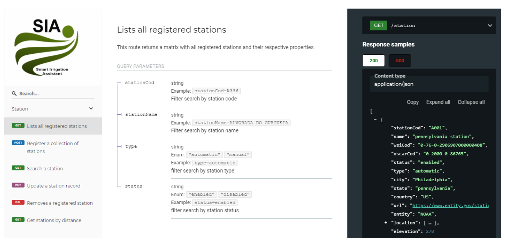

# SIA

A Smart Irrigation API (SIA) é uma Application Programming Interface (API) do tipo Representational State Transfer (REST), A API conta com um sistema de cache para armazenamento de elementos climáticos de outras fontes de dados por um período de 1 hora, tempo mínimo padrão para que estações e serviços em grade atualizem seus dados com novos valores de elementos climáticos. Além disso, SIA tem, também, como funcionalidade, o fornecimento de informações de coeficiente de cultura (Kc), a altura máxima atingida, evapotranspiração de referência e os comprimentos gerais para os quatro estágios distintos de crescimento de várias categorias de climas e locais, para uma variedade de culturas.

Os dados das estações meteorológicas de superfície são acessados de quatro entidades provedoras, Agência Estatal de Meteorologia (AEMET), Geographic Information System of Africa (AFRIGIS), Instituto Nacional de Meteorologia (INMET) e National Oceanic and Atmospheric Administration (NOAA).

